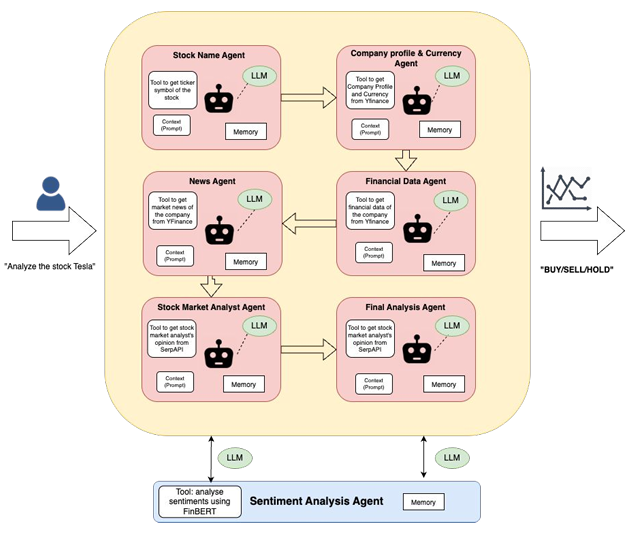
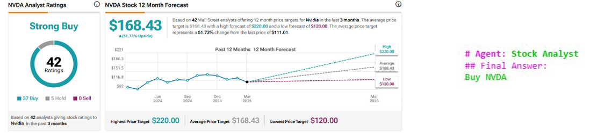
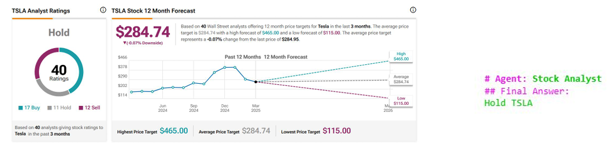
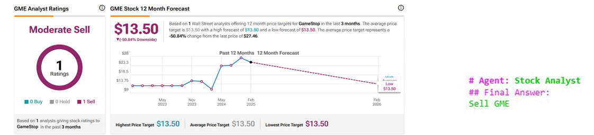

## 📁 Project Structure
```
automated-stock-market-analysis/
│
├── llm-driven-nlp-stock-market-analysis.ipynb
│         
├── architecture_overview.png/                         
│
├── Result_1.png/
│
├── Result_2.png/
│
├── Live Run.mov
│
└── README.md
```

## 🔍 Key Features

- 📈 Financial data retrieval and risk assessment
- 📰 News sentiment extraction and classification with FinBERT
- 📋 Analyst recommendation aggregation
- 🛠️ CrewAI-based modular agentic workflow
- 🤖 LLM agents for autonomous stock evaluation and action reasoning

---

## 📂 Data Sources

- Yahoo Finance API (financial data and news)
- Google News via SerpAPI (analyst opinions)
- FinBERT (sentiment analysis of news articles)

---

## 🛠️ Tools Used

- Python
- CrewAI Framework
- OpenAI APIs
- FinBERT
- SerpAPI
- Yahoo Finance API
- Jupyter Notebooks

---
## 🧠 Architecture Overview
Our system is powered by CrewAI, a multi-agent framework that allows sequential, role-based execution. Each agent is responsible for a specific task in the pipeline, ensuring a modular and interpretable architecture.

🧩 Agents in Action
- Stock Name Agent – Identifies stock ticker symbols
- Company Profile & Currency Agent – Fetches company metadata from Yahoo Finance
- Financial Data Agent – Retrieves structured financial data for the target stock
- News Agent – Scrapes recent headlines and news articles
- Stock Market Analyst Agent – Aggregates expert analyst opinions using SerpAPI
- Sentiment Agent – Applies FinBERT to classify public sentiment from news
- Final Analysis Agent – Synthesizes all inputs to generate a Buy, Sell, or Hold recommendation

🔁 Workflow Structure
Crew – The top-level orchestrator that manages agent flow
Tasks – Each agent is assigned a defined role with tool access and output expectations
Sequential Flow – The agents execute one after another, ensuring dependencies are respected

🧠 Built on CrewAI's structured agent collaboration, this system brings together LLMs, APIs, and real-time data to produce intelligent financial insights.



---
## ✅ Results

### 📊 Comparative Evaluation: AI vs. Analyst Consensus

Our CrewAI-powered LLM system was benchmarked against gold-standard analyst forecasts from TipRanks using three high-profile stocks — NVDA, TSLA, and GME.

---

### 🟢 NVDA (NVIDIA Corporation)



- 🧠 **AI Justification**: Average target $160.47 → Predicted `BUY`
- 🏅 **TipRanks Consensus**: Average target $168.43 → Recommended `BUY`
- 🧪 **BERTScore**: `Precision: 0.9126`, `Recall: 0.9485`, `F1: 0.9302`

---

### 🟡 TSLA (Tesla, Inc.)



- 🧠 **AI Justification**: Average target $304.38 → Predicted `HOLD`
- 🏅 **TipRanks Consensus**: Average target $284.74 → Recommended `HOLD`
- 🧪 **BERTScore**: `Precision: 0.7982`, `Recall: 0.8612`, `F1: 0.8285`

---

### 🔴 GME (GameStop Corp.)



- 🧠 **AI Justification**: Average target $13.50 → Predicted `SELL`
- 🏅 **TipRanks Consensus**: Average target $13.50 → Recommended `SELL`
- 🧪 **BERTScore**: `Precision: 0.7964`, `Recall: 0.8688`, `F1: 0.8310`

---

### 💡 Conclusion

Our system's final recommendations closely mirror those from trusted platforms like TipRanks.  
With BERTScore F1 values consistently above `0.82`, this validates the reliability, interpretability, and effectiveness of our multi-agent LLM-based financial analysis pipeline.


---


## 📬 Contact

For queries or collaborations, please reach out to [Pranav CR](https://github.com/PranavCR01).
