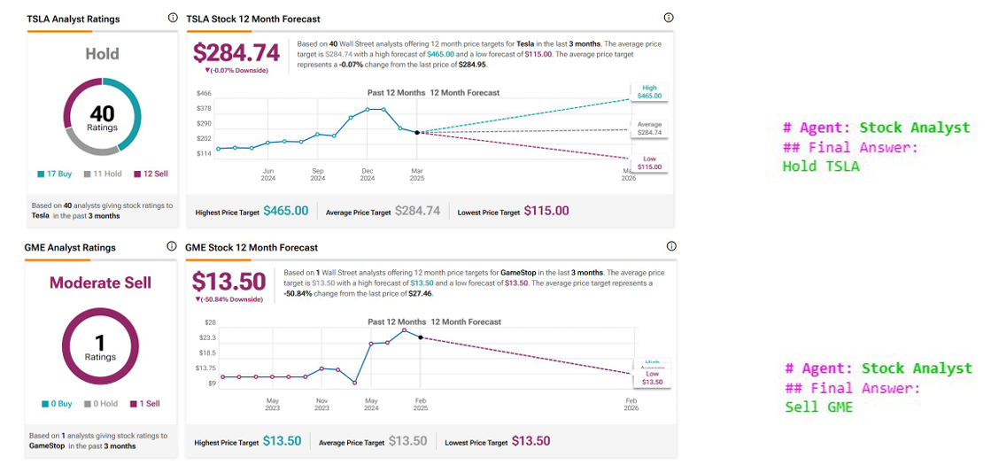

## 📁 Project Structure
```
automated-stock-market-analysis/
│
├── llm-driven-nlp-stock-market-analysis.ipynb
│         
├── architecture_overview.png/                         
│
├── Result_1.png/
│
├── Result_2.png/
│
├── Live Run.mov
│
└── README.md
```

## 🔍 Key Features

- 📈 Financial data retrieval and risk assessment
- 📰 News sentiment extraction and classification with FinBERT
- 📋 Analyst recommendation aggregation
- 🛠️ CrewAI-based modular agentic workflow
- 🤖 LLM agents for autonomous stock evaluation and action reasoning

---

## 📂 Data Sources

- Yahoo Finance API (financial data and news)
- Google News via SerpAPI (analyst opinions)
- FinBERT (sentiment analysis of news articles)

---

## 🛠️ Tools Used

- Python
- CrewAI Framework
- OpenAI APIs
- FinBERT
- SerpAPI
- Yahoo Finance API
- Jupyter Notebooks

---
## 🧠 Architecture Overview
Our system is powered by CrewAI, a multi-agent framework that allows sequential, role-based execution. Each agent is responsible for a specific task in the pipeline, ensuring a modular and interpretable architecture.

🧩 Agents in Action
- Stock Name Agent – Identifies stock ticker symbols
- Company Profile & Currency Agent – Fetches company metadata from Yahoo Finance
- Financial Data Agent – Retrieves structured financial data for the target stock
- News Agent – Scrapes recent headlines and news articles
- Stock Market Analyst Agent – Aggregates expert analyst opinions using SerpAPI
- Sentiment Agent – Applies FinBERT to classify public sentiment from news
- Final Analysis Agent – Synthesizes all inputs to generate a Buy, Sell, or Hold recommendation

🔁 Workflow Structure
Crew – The top-level orchestrator that manages agent flow
Tasks – Each agent is assigned a defined role with tool access and output expectations
Sequential Flow – The agents execute one after another, ensuring dependencies are respected

🧠 Built on CrewAI's structured agent collaboration, this system brings together LLMs, APIs, and real-time data to produce intelligent financial insights.


---
## ✅ Results



🧠 Sample Analysis: Tesla (TSLA)
The system generated the following recommendation using its multi-agent CrewAI architecture:
→ Program Output: Hold

🔎 External Analyst Verdict:
According to TipRanks, the current consensus from 40 Wall Street analysts also recommends a Hold rating on Tesla.

✅ Conclusion:
The system's final recommendation aligns with that of a trusted financial analysis platform, validating the effectiveness and reliability of our LLM-based pipeline.

---


## 📬 Contact

For queries or collaborations, please reach out to [Pranav CR](https://github.com/PranavCR01).
